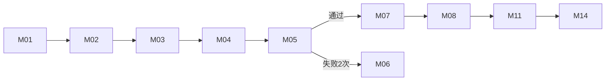
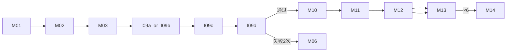
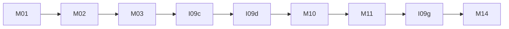
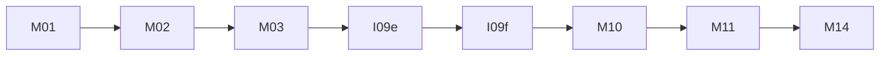

# 审讯实验系统 — 界面清单

本文档汇总程序中所有参与者可见界面、管理后台界面及弹层组件，便于你指定「要改哪一个界面」。  
修改时主要对应文件见各节 **源文件** 列。

---

## 一、页面入口（URL）

| 编号 | URL | 页面名称 | 源文件 |
|------|-----|----------|--------|
| P0 | `/` | 实验主流程（参与者端） | `templates/index.html` |
| P1 | `/questionnaire/pre` | 正式访谈 **前** 问卷 | `templates/questionnaire.html` |
| P2 | `/questionnaire/post` | 正式访谈 **后** 问卷 | `templates/questionnaire.html` |
| P3 | `/manage` | 数据管理后台 | `templates/manage.html` |

后端路由定义见 `app.py`（`render_template` 与各 `/api/*`）。

---

## 二、全局公共组件（`index.html`）

这些不是独立「屏」，但会叠加在多个界面上。

| 编号 | DOM ID / 类名 | 名称 | 说明 |
|------|---------------|------|------|
| G1 | `.header` | 顶栏 | 标题、副标题、导航链接（主流程 / 访谈前问卷 / 访谈后问卷）、管理齿轮 `openManagePanel()` |
| G2 | `#loadingOverlay` | 全屏加载遮罩 | `showLoading()` / `hideLoading()` |
| G3 | `#numberReminderModal` | 编号提示弹窗 | 嫌疑人注意力检测第二步、审讯者进入培训时弹出 |
| G4 | `#screenshotModal` | 截图确认弹窗 | 完成实验后确认是否已截图保存编号 |
| G5 | `.footer-note` | 页脚 | 版权与联系说明 |

---

## 三、主流程界面（`templates/index.html`）

主容器：`#app` 内多个 `.card`，通过 `showScreen('screen-xxx')` 切换，同一时刻只显示一个。

### 3.1 界面总表

| 编号 | Screen ID | Hash 路由（可选） | 界面标题 | 进入函数 | 适用角色 |
|------|-----------|-------------------|----------|----------|----------|
| M01 | `screen-phone` | `#/flow/phone` | 欢迎 / 手机号注册 | `showPhoneScreen()`、`register()` | 全部 |
| M02 | `screen-consent` | — | 知情同意书 | `showConsent()` | 全部（注册后） |
| M03 | `screen-dashboard` | `#/flow/dashboard` | 实验流程看板 | `showDashboard()` | 全部（同意后 / 恢复进度） |
| M04 | `screen-suspect-context` | `#/flow/suspect-context` | 嫌疑人 — 案件背景 | `showSuspectFlow()` | 嫌疑人 S |
| M05 | `screen-attention` | `#/flow/attention-check` | 嫌疑人 — 注意力检测 | `showAttentionCheck()` | 嫌疑人 S |
| M06 | `screen-attention-terminated` | — | 注意力失败 — 终止参与 | `showScreen('screen-attention-terminated')` | 嫌疑人 / 审讯者（检测失败） |
| M07 | `screen-game` | `#/flow/serious-game` | 嫌疑人 — 模拟行动游戏 | `showGameLink()` | 嫌疑人 S |
| M08 | `screen-profile` | `#/flow/profile` | 嫌疑人 — 个人信息问卷 | `showProfile()` | 嫌疑人 S |
| M09 | `screen-interviewer` | `#/flow/interviewer-training` | 审讯者 — 培训（多子界面） | `showInterviewerFlow()` 等 | 审讯者 I |
| M10 | `screen-case-info` | `#/flow/case-info` | 审讯者 — 案件信息与证据 | `showCaseInfo()` | 审讯者 I |
| M11 | `screen-booking` | `#/flow/booking` | 正式访谈时间预约 | `showBookingSystem()`、`showBookingFromCaseInfo()` 等 | 全部（流程内或首页入口） |
| M12 | `screen-avatar-training` | `#/flow/avatar-training-list` | Avatar — 6 次训练列表 | `showAvatarTrainingSessions()` | 审讯者（specific / general） |
| M13 | `screen-avatar-training-active` | `#/flow/avatar-training-active` | Avatar — 单次训练进行中 | `startAvatarTrainingSession()` | 审讯者（specific / general） |
| M14 | `screen-completion` | `#/flow/completion` | 实验完成 / 实验编号 | `showCompletion()` | 全部 |
| M15 | `screen-error` | `#/flow/error` | 错误提示 | `showError()` | 全部 |

> **说明**：`screen-consent`、`screen-attention-terminated` 未写入 `SCREEN_ROUTE_MAP`，浏览器地址栏 hash 可能不随这两屏变化。

---

### 3.2 M01 — 手机号注册 `screen-phone`

| 项目 | 内容 |
|------|------|
| 主要元素 | `#phoneInput`、`register()`、「预约管理」`showBookingFromHome()`、「已有账号？继续实验」`resumeBtn` |
| 相关 API | `POST /api/register`、`POST /api/lookup`（恢复） |

---

### 3.3 M02 — 知情同意书 `screen-consent`

| 项目 | 内容 |
|------|------|
| 主要元素 | `#consentContent`（动态加载正文）、`#btnAgree`（15 秒阅读计时）、「不同意并退出」 |
| 相关 API | `GET /api/consent/<role>`（`S` 或 `I`） |
| 下一步 | `agreeConsent()` → 看板 M03 |

---

### 3.4 M03 — 实验流程看板 `screen-dashboard`

| 项目 | 内容 |
|------|------|
| 主要元素 | `#dashboardRole`、`#dashboardId`、`#dashboardGroup`、`#dashboardSteps`、`#dashboardTrainingInfo`、`#dashboardStartBtn` |
| 步骤文案 | 按角色与 `training_type` 动态生成（嫌疑人 5 步；审讯者分 theory_sue / avatar_* / control） |
| 下一步 | `startFromDashboard()` → 嫌疑人流程或 `showInterviewerFlow()` |

---

### 3.5 嫌疑人流程

#### M04 — 案件背景 `screen-suspect-context`

- 显示：案件类型、组别、`#suspectContext` 全文
- 操作：下载背景、`showAttentionCheck()`
- API：注册/lookup 返回的 `context`、`attention_questions`

#### M05 — 注意力检测 `screen-attention`

- 动态区：`#attentionQuestions`、`#attentionFeedback`
- 按钮：`#attentionSubmitBtn`、`#attentionRetryBtn`（第二次失败前）
- API：`POST /api/verify-attention`
- 失败两次 → M06；通过 → M07

#### M06 — 检测失败终止 `screen-attention-terminated`

- 文案：`#attentionTerminatedMsg`（默认：两次错误、手机号已记录）
- 共用：嫌疑人注意力、审讯者 SUE EFM、审讯者对照组注意力失败

#### M07 — 模拟行动游戏 `screen-game`

| 子状态 | DOM | 说明 |
|--------|-----|------|
| 介绍 | `#sg-intro` | 「开始游戏」`startSeriousGame()` |
| 进行中 | `#sg-play` | 视频 `#sg-player`、选项浮层 `#sg-choice-overlay` |
| 完成 | `#sg-completed` | → `sgProceedToProfile()` → M08 |

- API：`/api/serious-game/*`（start、step、choice、next、complete）

#### M08 — 个人信息问卷 `screen-profile`

- 动态表单：`#profileForm`（23 题，`PROFILE_QUESTIONS`）
- 进度：`#profileProgress`
- API：`POST /api/submit-profile`
- 完成后 → M11 预约

---

### 3.6 审讯者培训容器 M09 — `screen-interviewer`

**外壳固定**：标题「您的角色：审讯者」、`#interviewerGroup`、动态区 `#trainingContent`、可选 `#avatarChatArea`、可选 `#interviewerCompleteBtn`。

**内部子界面**（均渲染在 `#trainingContent`，不换 screen id）：

| 子编号 | 函数 | 标题/用途 | 培训类型 | 备注 |
|--------|------|-----------|----------|------|
| I09a | `showAvatarSpecificInstructions()` | 第一步：Specific Avatar 培训说明 | `avatar_specific` | 30 秒阅读计时 → SUE |
| I09b | `showAvatarGeneralInstructions()` | 第一步：通用 Avatar 培训说明 | `avatar_general` | 30 秒阅读计时 → SUE |
| I09c | `showSUEMaterial(source)` | 阅读 SUE 理论培训材料 | 全部需 SUE 的组 | `source`: theory_sue / avatar_specific / avatar_general；30 秒计时 → EFM |
| I09d | `showSueAttentionCheck()` / `renderSueEFMCheck()` | SUE — EFM 证据框架矩阵检测 | 同上 | API：`/api/verify-sue-attention`；失败两次 → M06 |
| I09e | `showControlGroup()` | 对照组 — 阅读材料 | `control` | 材料区 `#controlDocxContent`、`#controlActionArea` |
| I09f | `showControlAttentionCheck()` | 对照组 — 注意力检测 | `control` | API：`/api/verify-control-attention`；失败两次 → M06 |
| I09g | `showAvatarTraining()` | 单次 Avatar 练习（非 6 次） | `theory_sue` | 显示 `#avatarChatArea` + LiveAvatar 语音审讯；`completeInterviewer()` 结束 |

**审讯者培训类型分支**（`showInterviewerFlow`）：

```
theory_sue      → I09c → I09d → M10 案件 → M11 预约 → I09g 练习 → 完成
avatar_specific → I09a → I09c → I09d → M10 → M11 → M12 六次训练
avatar_general  → I09b → I09c → I09d → M10（恐袭通用案件）→ M11 → M12
control         → I09e → I09f → M10 → M11 → 完成（无 Avatar 六次）
```

---

### 3.7 M10 — 案件信息 `screen-case-info`

| 项目 | 内容 |
|------|------|
| 主要元素 | `#caseInfoTitle`、`#caseInfoContent`（概述 + 证据列表）、`#caseInfoGroup`、`#caseInfoNextBtn` |
| API | `POST /api/case-info` |
| 案件来源 | specific/control/theory_sue：配对嫌疑人案件（纵火/盗窃）；`avatar_general`：通用恐袭案件 `GENERAL_TERRORISM_CASE_INFO` |
| 下一步 | `showBookingFromCaseInfo()` → M11 |

---

### 3.8 M11 — 预约 `screen-booking`

| 区域 | DOM | 说明 |
|------|-----|------|
| 说明文案 | 卡片顶部静态段落 | 双名额、配对规则、颜色图例 |
| 手机号查询 | `#bookingPhoneInput`、`#bookingPhone` | 从首页「预约管理」进入时显示 |
| 我的预约 | `#myBookingInfo` | 已预约信息、修改/取消 |
| 时段列表 | `#bookingSlotList` | 按日展示可约时段 |
| 预约结果 | `#bookingResult` | 预约成功反馈、实验编号等 |
| 流程按钮区 | `#bookingActionArea` | 审讯者预约后跳转 6 次训练等 |

- API：`/api/appointments/slots`、`book`、`my`、`modify`、`cancel`
- 时段规则：见 `app.py` `_candidate_booking_slots()`（上午/下午/晚上，未来 5 天）

---

### 3.9 Avatar 六次训练

#### M12 — 训练列表 `screen-avatar-training`

| 项目 | 内容 |
|------|------|
| 主要元素 | `#trainingTypeHint`、`#trainingSessionList`（3×2 网格）、`#trainingSessionActions` |
| 显示规则 | `avatar_general` **不显示** 每条的人格/有罪标签；`avatar_specific` 显示 |
| API | `POST /api/avatar-training/status` |
| 操作 | `startAvatarTrainingSession(n)` → M13 |

#### M13 — 单次训练 `screen-avatar-training-active`

| 区域 | DOM | 说明 |
|------|-----|------|
| 标题/设定 | `#activeSessionTitle`、`#activeSessionSetting` | general 组设定标签可简化 |
| 视频 | `#trainingLiveVideoContainer`、`#trainingVideoPlaceholder` | LiveAvatar |
| 对话 | `#trainingChatArea`、`#trainingChatMessages` | 转写与回复 |
| 录音 | `#trainingRecordBtn`、`#trainingRecordStatus` | 语音 STT → LLM → TTS |
| 结束访谈 | `endTrainingSession()` | |
| 提交判断 | `#trainingJudgmentForm`、`#submitTrainingJudgmentBtn` | 有罪/无罪 |
| 反馈展示 | `#trainingFeedbackArea` | DeepSeek + `materials/prompts/avatar_feedback.md`；记录写入 `experiment_data.xlsx` |

- API：`/api/avatar-training/start|submit|chat|tts|stt|save-transcript`

**M13 内嵌子步骤**（同一 screen，非独立 id）：

1. 连接 Avatar → 语音讯问  
2. `showTrainingJudgmentForm()` — 有罪/无罪表单  
3. `showTrainingFeedback()` — 查看本次反馈（也可在 M12 列表「查看反馈」）

---

### 3.10 M14 — 完成 `screen-completion`

- `#completionMsg`：实验编号与完成说明  
- 操作：下载全部材料、`showScreenshotModal()`（G4）  
- API：`POST /api/complete-interviewer`（审讯者）、嫌疑人预约完成逻辑  

---

### 3.11 M15 — 错误 `screen-error`

- `#errorMsg` + 重新开始 `location.reload()`

---

## 四、正式访谈问卷页（`templates/questionnaire.html`）

独立单页，两阶段共用模板，由服务端 `phase` 区分。

| 编号 | 界面 | DOM / 函数 | 说明 |
|------|------|------------|------|
| Q01 | 登录/查询卡 | 首屏 `.card`（非 hidden） | `#phaseTitle`（访谈前/后）、`#phoneInput`、`loadQuestionnaire()` |
| Q02 | 问卷填写卡 | `#questionCard` | `#metaInfo`、`#questionForm`、`submitQuestionnaire()` |

| 项目 | 内容 |
|------|------|
| URL | `/questionnaire/pre` → `phase=pre`；`/questionnaire/post` → `phase=post` |
| API | `/api/questionnaire/status`、`questions`、`submit` |
| 题目来源 | `app.py` 中 `INTERVIEW_QUESTION_BANK`（按角色 S/I 与阶段过滤） |
| 开放控制 | 管理后台可 override；默认按预约时间窗口开放 |

---

## 五、管理后台（`templates/manage.html`）

单页多卡片纵向排列，需管理密码（`sessionStorage.admin_password`）。

| 编号 | 区块标题 | 主要 DOM | 功能 |
|------|----------|----------|------|
| A01 | 顶栏工具条 | `.toolbar` | 返回首页、刷新 `loadData()` |
| A02 | 查找与筛选 | `#fGroup`、`#fPhone`、`#fTime`、`#fRole`、`#fStatus`、`#fCompleted` | `applyFiltersAndRender()` |
| A03 | 参与实验结果（组别看板） | `#groupGrid`、`#participantCount` | 按组展示嫌疑人/审讯者配对与进度 |
| A04 | 预约时段管理 | `#slotConfigWrap` | **日期列表** → 点击日期 → **当日各时段开关**；`toggleSlot()` |
| A05 | 预约记录（日历视图） | `#calendarWrap`、`#appointmentCount` | 日历形式展示已预约 |
| A06 | 参与者明细 | `#participantTable` | 删人、问卷开放开关等 |
| A07 | 预约明细 | `#appointmentTable` | 删除预约记录 |
| A08 | 访谈问卷明细 | 问卷表格 tbody | 查看 pre/post 提交答案 |

---

## 六、流程简图（便于对照编号）

### 6.1 嫌疑人（S）



### 6.2 审讯者 — Avatar 组（specific / general）



### 6.3 审讯者 — SUE 理论组（theory_sue）



### 6.4 审讯者 — 对照组（control）



---

## 七、指定修改时建议写法

你可以直接引用 **编号**，例如：

- 「修改 **M02** 知情同意书：延长阅读时间为 30 秒」
- 「修改 **I09d** SUE EFM 检测的题目文案」
- 「修改 **M12** 六次训练列表的排版」
- 「修改 **A04** 管理后台预约时段管理的默认时段」
- 「修改 **Q02** 访谈后问卷的某一题」

也可同时给出 **Screen ID**（如 `screen-case-info`）或 **源文件 + 函数名**，便于精确定位。

---

## 八、相关后端与素材（非界面，常一起改）

| 类型 | 路径/说明 |
|------|-----------|
| 主逻辑 | `app.py` |
| 知情同意 / 培训材料 | `materials/combined_materials.md`（合并合集）→ `/api/consent/`、`/api/material-text/` |
| 材料下载 | `materials/combined_materials.docx`（培训材料合集） |
| 反馈 Prompt | `materials/prompts/avatar_feedback.md` |
| 通用案件 | `GENERAL_TERRORISM_CASE_INFO`（`app.py`） |
| 实验数据 | 仅 `experiment_data.xlsx`（含 `serious_game_choices`、`training_sessions` 等表） |

---

*文档生成自当前代码结构；若新增 screen 或拆分子界面，请同步更新本表。*
